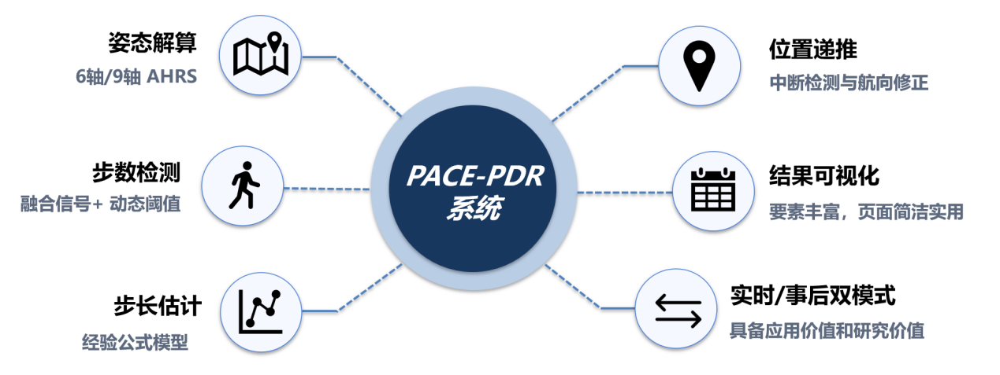
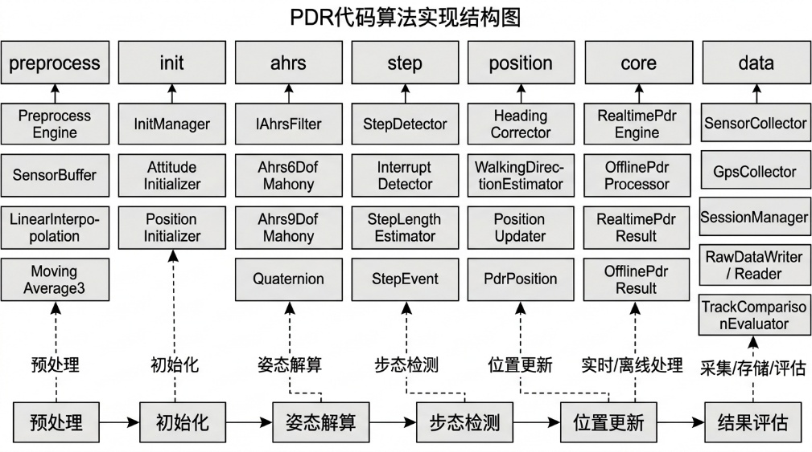

# PACE-PDR

> 基于 Android 的行人航位推算（PDR, Pedestrian Dead Reckoning）实验系统

PACE-PDR 是一个面向手机端的 PDR 实验平台，融合加速度计、陀螺仪、磁力计和 GPS 等多源传感器，实现姿态解算、步态检测、步长估计、航向修正、位置递推与轨迹可视化，并支持**实时运行**与**事后离线回放评估**。

---

## 项目简介

本项目旨在构建一个完整的手机端 PDR 处理链路，从**传感器采集**、**数据预处理**、**初始化**、**AHRS 姿态解算**、**步态检测**、**步长估计**到**位置更新**与**结果评估**，形成一套可运行、可分析、可扩展的实验系统。

PACE-PDR 不仅可以作为一个 Android 应用进行实时实验演示，也适合作为：

- 行人航位推算算法验证平台
- 多传感器融合定位实验平台
- 本科课程设计 / 毕业设计项目
- 论文实验与演示系统

---

## 项目亮点

- 基于 Android 手机内置传感器实现 PDR
- 支持 **6 轴 / 9 轴 Mahony AHRS** 姿态解算
- 支持 **实时模式** 与 **事后离线模式**
- 支持多传感器同步、插值与平滑预处理
- 支持步态检测、步长估计、航向修正与位置递推
- 支持轨迹可视化、实验数据保存与结果导出
- 支持 PDR 与 GPS 轨迹对比评估

---

## 系统总览

<p align="center">
  
</p>

PACE-PDR 系统围绕以下六个核心能力构建：

- **姿态解算**：支持 6 轴 / 9 轴 AHRS
- **步数检测**：融合多种信号与动态阈值策略
- **步长估计**：基于经验模型进行自适应估计
- **位置递推**：结合中断检测与航向修正进行更新
- **结果可视化**：提供简洁直观的轨迹显示界面
- **实时 / 事后双模式**：兼顾应用价值与研究分析价值

---

## 系统架构

<p align="center">
  
</p>

项目按照模块化思路组织，核心包括：

- `preprocess`：数据同步、插值、滑动平均
- `init`：姿态与初始位置初始化
- `ahrs`：6DOF / 9DOF Mahony 姿态解算
- `step`：步态检测、步长估计、中断检测
- `position`：航向修正、位置更新
- `core`：实时 / 离线 PDR 主流程
- `data`：传感器采集、文件存储、结果评估

---

## 应用界面展示

<p align="center">
  
</p>

界面可展示以下关键信息：

- 当前模式（实时 PDR / 事后 PDR）
- 初始化状态与初始化结果
- AHRS 模式（6轴 / 9轴）
- PDR 轨迹结果
- 步数统计
- 行进距离
- GPS 轨迹显示开关

---

## 主要功能

### 1. 多传感器数据采集
- 实时采集手机加速度计、陀螺仪、磁力计与 GPS 数据
- 支持实验会话管理与原始数据保存

### 2. 数据预处理
- 多源异步传感器时间同步
- 线性插值
- 滑动平均滤波
- 为后续姿态估计与步态检测提供稳定输入

### 3. 初始化
- 静止阶段完成初始姿态估计
- 获取初始横滚角、俯仰角、磁航向与真航向
- 支持位置初始化

### 4. AHRS 姿态解算
- `Ahrs6DofMahony`
- `Ahrs9DofMahony`

支持不同场景下的姿态解算策略切换，用于比较 6 轴与 9 轴融合效果。

### 5. 步态检测与步长估计
- 融合多特征进行步态检测
- 支持动态阈值策略
- 支持步长经验模型估计

### 6. 航向修正与位置递推
- 利用姿态解算结果获得航向
- 在检测到有效步事件后进行按步更新
- 支持航向平滑与中断检测修正

### 7. 结果评估与导出
- 支持 PDR 与 GPS 轨迹对比
- 支持结果文件保存与导出
- 便于实验分析、论文撰写与答辩展示

---

## 处理流程

```text
传感器采集
   ↓
数据预处理（同步 / 插值 / 平滑）
   ↓
初始化（姿态 / 初始位置）
   ↓
AHRS 姿态解算
   ↓
步态检测
   ↓
步长估计
   ↓
航向修正
   ↓
位置更新
   ↓
轨迹可视化 / 文件保存 / GPS 对比评估
